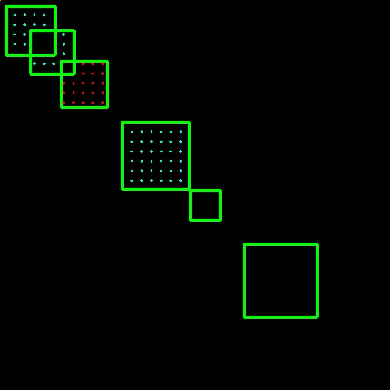
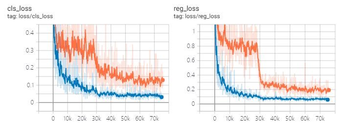
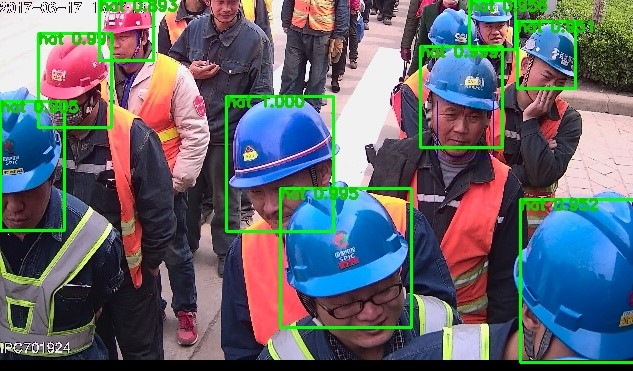
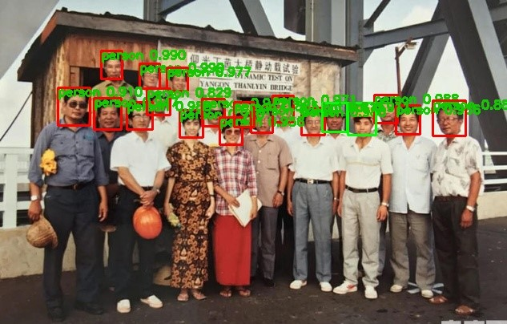

## LFFD: A Light and Fast Face Detector for Edge Devices
[paper link](https://arxiv.org/pdf/1904.10633.pdf)  
## Requirements:  
* pytorch>=1.2  
* opencv-python  
* torchvision>=0.4  
## Label Assignment  
Boxes are in different scale. Anchor points with more than one matched gt box are ignored.  
`green box --> gt box`  
`blue/red point --> positive sample`  
The positive sample sampling of the fifth branch is shown below.  

  
## Different settings from the paper  
* regression target
* add BN
* more classes  
## Test  
I have trained the model on a safety helmet dataset without any augmentation. It seems to be working well.  

    
    

        <em>tensorboard</em>
    

      
      
    

        <em>test_result</em>
    

